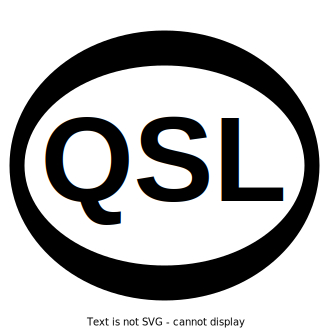
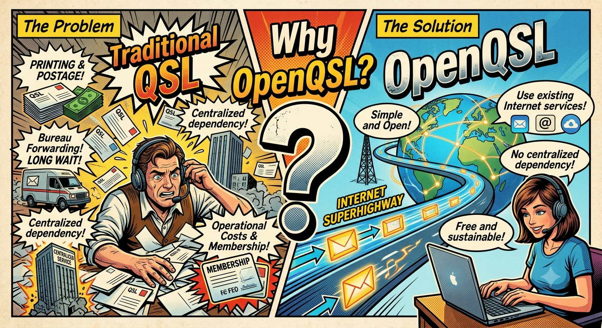
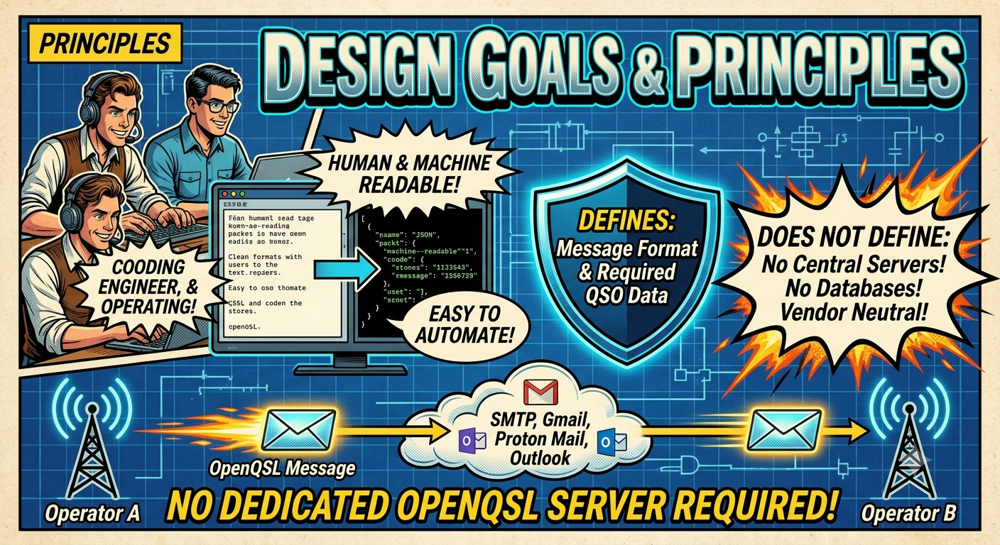

<p align="center">
  
</p>

## 1. What is OpenQSL?


**OpenQSL** is an open specification for exchanging amateur radio QSL confirmations using existing Internet infrastructure.

OpenQSL is **not** a service, **not** a website, and **not** operated by any organization. It is an open, vendor-neutral specification that anyone can implement without relying on a particular organization.

Just as SMTP standardized email and HTTP standardized the Web, OpenQSL aims to provide a simple, open, and interoperable specification for electronic QSL exchange.

---

## 2. Why OpenQSL?



Traditional QSL systems have served the amateur radio community for many years, but they also present several challenges.

* Paper QSL cards require printing, postage, storage, and forwarding through a bureau (bureau system).
* Existing electronic QSL systems often depend on specific organizations or centralized services.
* Some systems require registration, membership, or operational costs.
* Long-term operation depends on maintaining dedicated infrastructure.

OpenQSL aims to provide a simple and open alternative by leveraging only the existing Internet services that people already use every day.

---

## 3. Design Goals



### 3.1. Principles
OpenQSL is designed with the following principles:

* Open specification
* Free to use
* Vendor neutral (independent of specific organizations)
* Server independent
* Human readable
* Machine readable
* Easy to implement
* Easy to automate
* Backward extensible

### 3.2. What OpenQSL Defines

OpenQSL defines only the specification for exchanging QSL confirmations.
The specification may include:

* Message format
* Required QSO information
* Optional metadata
* Attachment file formats
* Attached card formats
* Versioning
* Security recommendations

### 3.3. What OpenQSL Does NOT Define

OpenQSL intentionally does **not** define:

* Mail servers
* Web services
* Databases
* User registration
* Membership systems
* Award programs
* Logbook management

These services may be implemented independently while remaining compatible with the OpenQSL specification.

### 3.4. Transport

OpenQSL is transport independent.
Typical implementations may use:

* Email (SMTP)
* Gmail
* Outlook
* Proton Mail
* Yahoo Mail

Future transports may also be defined.

### 3.5. Example Workflow

```text
Operator A  --------------> Existing Internet Service ----> Operator B
              OpenQSL Message
```

No dedicated OpenQSL server is required.

---

## 4. Project Status


This project is currently in the proposal stage.
The initial goal is to discuss, refine, and publish an open specification before developing software implementations.

Your participation, ideas, discussions, Issues, and Pull Requests are welcome.

---

## 5. License

This repository is released under the MIT License unless otherwise noted.

---

## 6. Origin of the Idea

The idea for OpenQSL began with a simple question from a friend:

> "Could there be a better alternative to traditional paper QSL cards and today's electronic QSL systems?"

That question led me to reconsider something that amateur radio operators already do during every contact: "accurately exchanging their callsigns."
I realized that if operators used an email address formatted as `callsign@domainname` (for example, `JA1***@gmail.com`), exchanging an electronic QSL could become remarkably simple.

For example, at the end of a contact, saying:

> "Let's exchange via gQSL."

would simply mean:

> "Please send your QSL to `JA1***@gmail.com`."

This **gQSL** was the original concept.
As I explored the idea further, I realized that the concept should not depend on Gmail or any other specific provider.
The real value was not a particular service, but the possibility of defining an **open specification** that could operate over existing communication infrastructure.
That realization became the foundation of **OpenQSL**.

---

## 7. Project Ownership

OpenQSL was started as a personal initiative with a simple goal: to make the future of amateur radio more open, more accessible, and more sustainable.

Actually, I hold an amateur radio license, but I am not an active radio operator.
This project is motivated not by personal operating needs, but by an interest in open standards and the long-term future of the amateur radio community.

From the beginning, OpenQSL has been intended as a community-driven specification rather than a personal project.
I hope to invite contributors, reviewers, and maintainers from the amateur radio community as early as possible.
As the project matures, I intend to transition its stewardship to the community so that OpenQSL can evolve independently of me as an individual.

If you believe in the goals of OpenQSL and would like to help shape its future, your participation is warmly welcome.
